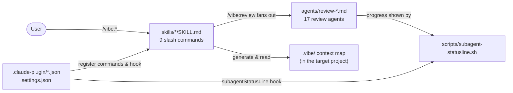

> Generated by /vibe:docs — manual edits will be overwritten; use README for hand-written content.

# Architecture

This plugin has **no runtime of its own**: it is a set of Markdown instruction files (skills and agents) consumed directly by Claude Code, plus one shell script and three JSON manifests. There is no build step, no package manifest, no test framework — deliberately (see `docs/development.md`).

## Repository layout

```
claude-plugin-vibe/
├── .claude-plugin/
│   ├── plugin.json        # plugin identity: name "vibe", version, keywords
│   └── marketplace.json   # marketplace listing pointing at this repo
├── skills/<name>/SKILL.md # one directory per /vibe:* slash command (9 skills)
├── agents/review-*.md     # one file per review dimension (17 agents)
├── scripts/subagent-statusline.sh  # renders the agent-panel status line
├── settings.json          # wires the subagentStatusLine hook to the script
└── docs/                  # this developer documentation + the GitHub Pages site
```

## How the parts connect



## Skills (`skills/`)

Each `/vibe:<name>` command is a self-contained instruction set in `skills/<name>/SKILL.md`, with frontmatter `name`, `description`, and optional `argument-hint`. The nine skills cover the full workflow: `init`, `backlog`, `feature`, `fix`, `review`, `sync`, `changelog`, `docs`, `release`.

Skills invoke each other through the Skill tool rather than duplicating logic: `feature` and `fix` call `sync` (and `docs`/`changelog` steps) before committing; `init` calls `sync` to bootstrap `.vibe/`; `release` refreshes docs and changelog. Runtime verification is delegated to Claude Code's native `verify` skill. The dynamic side of these flows is documented in `docs/workflows.md`.

## Review agents (`agents/`)

Each `agents/review-<dimension>.md` audits exactly one quality dimension (frontmatter: `name`, `description`). `/vibe:review` reads the activation table in the target project's `CLAUDE.md`, re-checks each activation condition against the project's current state, then runs the active agents in parallel. Overlapping checks are explicitly delegated: each check belongs to one owning agent, so the same issue is never reported from two angles.

Most agents are read-only; two are not: `review-tests` executes the project's real test suite, and `review-pentest` probes a locally-launched instance of the target application.

## Status line (`scripts/` + `settings.json`)

`settings.json` declares a `subagentStatusLine` hook pointing at `scripts/subagent-statusline.sh`. The script reads a JSON payload (`{columns, tasks: [...]}`) on stdin, and emits one `{id, content}` JSON line per agent row via `jq` — status icon (looked up from the task's status through a small alias table), bold name, description, token count, truncated to the terminal width. On malformed input it logs a diagnostic to stderr and exits cleanly instead of going silently blank. It is most visible during `/vibe:review`, which can run up to 17 agents side by side.

## Generated state in target projects

The plugin writes into the *target* project (not into this repo, except for dogfooding): `CLAUDE.md` (by `init`), the `.vibe/` context map — `index.md`, `modules/`, `models.md`, a fully code-derived `glossary.md`, plus work data `backlog/`, `decisions/`, `escalations.md`, `last-review.md` (by `sync` and the workflow skills). The lifecycle of each entry is recorded in the generated `.vibe/README.md`.
