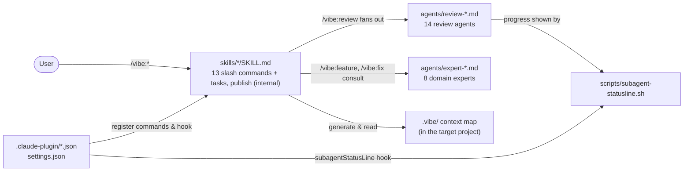

> Generated by /vibe:docs — manual edits will be overwritten; use README for hand-written content.

# Architecture

This plugin has **no runtime of its own**: it is a set of Markdown instruction files (skills and agents) consumed directly by Claude Code, plus one shell script and three JSON manifests. There is no build step, no package manifest, no test framework — deliberately (see `docs/development.md`).

## Repository layout

```
claude-plugin-vibe/
├── .claude-plugin/
│   ├── plugin.json        # plugin identity: name "vibe", version, keywords
│   └── marketplace.json   # marketplace listing pointing at this repo
├── skills/<name>/SKILL.md # one directory per skill (13 /vibe:* slash commands + 2 internal)
├── agents/review-*.md     # one file per review dimension (14 agents, after-the-fact critics)
├── agents/expert-*.md     # one file per domain expert (8 agents, before/during prescriptive consultants)
├── scripts/subagent-statusline.sh  # renders the agent-panel status line
├── settings.json          # wires the subagentStatusLine hook to the script
└── docs/                  # this developer documentation + the GitHub Pages site
```

## How the parts connect


```mermaid
flowchart LR
    user([User]) -- "/vibe:*" --> skills["skills/*/SKILL.md<br/>13 slash commands + tasks, publish (internal)"]
    skills -- "/vibe:review fans out" --> agents["agents/review-*.md<br/>14 review agents"]
    skills -- "/vibe:feature, /vibe:fix consult" --> experts["agents/expert-*.md<br/>8 domain experts"]
    skills -- "generate & read" --> vibe[".vibe/ context map<br/>(in the target project)"]
    manifests[".claude-plugin/*.json<br/>settings.json"] -- "register commands & hook" --> skills
    manifests -- "subagentStatusLine hook" --> statusline["scripts/subagent-statusline.sh"]
    agents -- "progress shown by" --> statusline
```

## Skills (`skills/`)

Each `/vibe:<name>` command is a self-contained instruction set in `skills/<name>/SKILL.md`, with frontmatter `name`, `description`, and optional `argument-hint`. Thirteen skills are user-invocable slash commands covering the full workflow: `init`, `backlog`, `clarify`, `feature`, `fix`, `auto`, `review`, `sync`, `changelog`, `docs`, `release`, `workspace-init`, `next-task`. A fourteenth, `tasks`, sets `user-invocable: false` — hidden from the `/` menu, callable only by the others through the Skill tool.

Skills invoke each other through the Skill tool rather than duplicating logic: `feature` and `fix` call `sync` (and `docs`/`changelog` steps) before committing; `init` calls `sync` to bootstrap `.vibe/`; `release` refreshes docs and changelog. `backlog`, `init`, and `workspace-init` also invoke `clarify` conditionally — only when what they have to work with (a one-line item description, an empty project's stated idea, a new workspace's purpose) is too thin to act on safely — and fold its settled synthesis back into their own flow instead of guessing. `init`, `feature`, `fix`, `review`, `docs`, `release`, and `workspace-init` all delegate task-list creation to `tasks`, which owns the only fallback logic (a scratchpad checklist) for when `TaskCreate` is unavailable in the environment. `auto` is the only skill that drives other skills through sub-agents — one per backlog item, strictly sequential since they share the Git working tree — so its own context stays constant over a long unattended run. Runtime verification is delegated to Claude Code's native `run` skill. `next-task` is the only skill in the plugin that pushes and publishes on its own — every other skill, including `auto`, stops at a local commit by design. The dynamic side of these flows is documented in `docs/workflows.md`.

## Interviewing for missing detail (`clarify`)

`clarify` (`skills/clarify/SKILL.md`) maps whatever it's given — a plan, an idea, a decision — as a design tree of dependent questions, and works it round by round: each round asks every currently-answerable question at once, with a recommended answer, then waits; an answer can unblock questions that depended on it, reshaping the tree for the next round. Any question answerable by looking rather than asking is dispatched to a sub-agent instead of put to the user. It ends with a `CLARIFY-RESULT: settled|partial|abandoned` line plus a `### Synthesis`/`### Decisions made` payload — read identically whether a human typed `/vibe:clarify` directly or another skill invoked it and needs to keep going with the answer. Its own dialogue adapts to whichever language the conversation is in, unlike the rest of the plugin's user-facing strings, which are fixed English (see `docs/development.md`).

## Multi-repo workspaces (`workspace-init`, `next-task`)

Two skills extend the plugin above the single-repo level, for a project split across several sibling Git repo checkouts under one parent folder (a **workspace root**, never itself a Git repo):

- `workspace-init` bootstraps or refreshes a **hub repo** — a Git repo with no application code, recognized structurally (any directory with `.git/` and a `repos.md` at its root) rather than by a fixed name — holding the `repos.md` registry of sibling repos and a workspace-scoped `.vibe/backlog/`+`.vibe/decisions/`. It also writes a local, never-committed `CLAUDE.md` at the workspace root pointing at the hub repo, read back by both skills on later runs instead of re-scanning.
- `next-task` reads that registry to pick the next eligible backlog item across every `active` sibling repo, hands it to `feature`/`fix` (or `auto --push` in auto mode) in the right repo, then pushes and — if the changelog warrants it — releases through the internal `publish` skill. Cross-repo blockers are never structured data (`depends_on` only ever references the same repo, by design): they live in free prose read by this skill, the same way any other skill's `## Notes` is interpreted rather than parsed as a schema. With no workspace detected but a `.vibe/backlog/` in the current directory, it falls back to picking within that one repo — still pushing/releasing afterward, which is what distinguishes it from `auto` even at that scope.

## Review agents (`agents/`)

Each `agents/review-<dimension>.md` audits exactly one quality dimension (frontmatter: `name`, `description`, `tools`). The finding format, severity scale, and read-only rule are not repeated per agent: `/vibe:review` injects that shared contract into every agent prompt. It reads the activation table in the target project's `CLAUDE.md`, re-checks each activation condition against the project's current state, then runs the active agents in parallel. Overlapping checks are explicitly delegated: each check belongs to one owning agent, so the same issue is never reported from two angles.

Agents are read-only by their `tools` frontmatter; three also get Bash: `review-tests` executes the project's real test suite, `review-dependencies` runs the stack's audit tool, and `review-web-security` probes a locally-launched instance when its opt-in dynamic mode is enabled. `review-architecture` also covers ports & adapters for projects that explicitly adopted them.

## Expert agents (`agents/expert-*.md`)

Where review agents critique code that already exists, `agents/expert-<domain>.md` agents prescribe requirements *before or during* implementation — consulted by `/vibe:feature` and `/vibe:fix` while planning (up to 3, selected per-task by matching the brief against agent descriptions) and on demand for one precise question per sub-task while coding. The roster (`ui-ux`, `frontend-design`, `api-rest`, `cli-dx`, `data`, `linux`, `ops`) is deliberately limited to domains with no `review-*` counterpart, to avoid two near-duplicate definitions of the same expertise — recorded in `.vibe/decisions/001-expert-personas-scope.md`. One narrow exception exists: `expert-realtime-rendering` is paired with `review-performance` (widened to also cover frame budget/allocation/draw-call batching) because ex-ante frame-budget and allocation-discipline choices are hard to retrofit once rendering code is written — recorded in `.vibe/decisions/003-realtime-rendering-expert-exception.md`. Unlike review agents, there is no per-project activation table: selection happens per task, not per project.

## Status line (`scripts/` + `settings.json`)

`settings.json` declares a `subagentStatusLine` hook pointing at `scripts/subagent-statusline.sh`. The script reads a JSON payload (`{columns, tasks: [...]}`) on stdin, and emits one `{id, content}` JSON line per agent row via `jq` — status icon (looked up from the task's status through a small alias table), bold name, description, token count, truncated to the terminal width. Both failure modes — a stdin read that fails, or malformed JSON that `jq` can't parse — log a diagnostic to stderr and exit cleanly instead of aborting silently. It is most visible during `/vibe:review`, which can run up to 14 agents side by side.

## Generated state in target projects

The plugin writes into the *target* project (not into this repo, except for dogfooding): `CLAUDE.md` and `README.md` (by `init`, which delegates the README's managed sections to `docs`), the `.vibe/` context map — `index.md`, `modules/`, `models.md`, a fully code-derived `glossary.md`, plus work data `backlog/`, `decisions/`, `escalations.md`, `last-review.md`, and `auto-state.md` (by `sync` and the workflow skills). The lifecycle of each entry is recorded in the generated `.vibe/README.md`.
