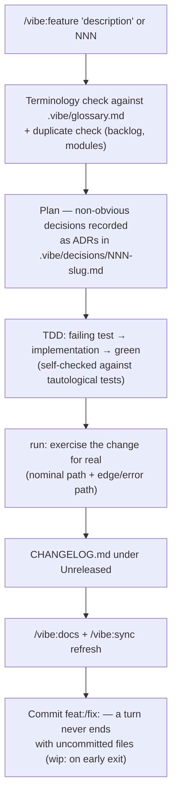
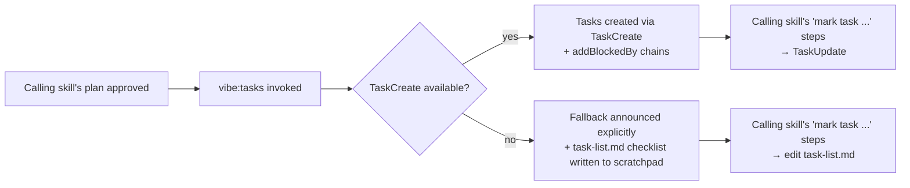
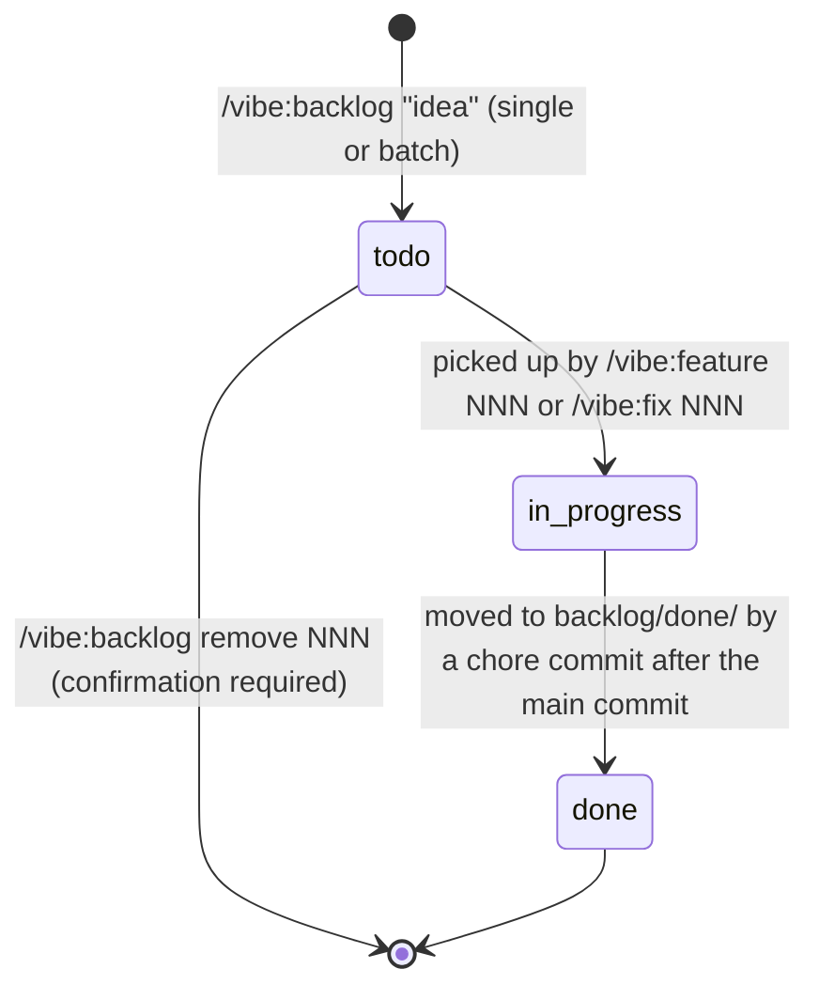
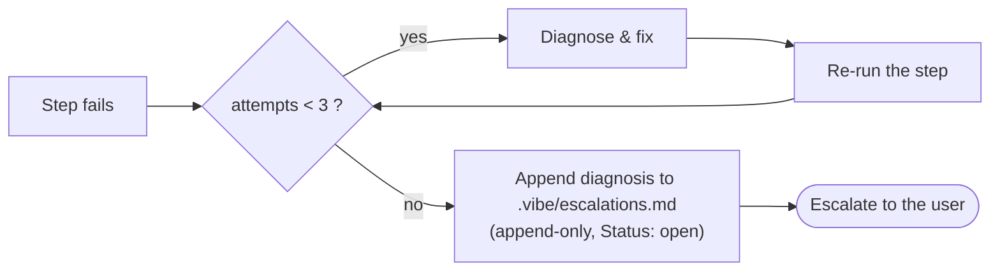

> Generated by /vibe:docs — manual edits will be overwritten; use README for hand-written content.

# Workflows

The lifecycles implemented by the `/vibe:*` commands. Static structure is covered in `docs/architecture.md`; this file describes what happens *over time*.

## Feature / fix lifecycle

`/vibe:feature` and `/vibe:fix` (defined in `skills/feature/SKILL.md` and `skills/fix/SKILL.md`) share the same spine — the fix variant reproduces the bug with a failing test first:

`run` launches the app itself — finding or establishing how to start the project — so no separate fallback skill is needed if launch mechanics are the blocker; after 3 failed attempts the skill escalates directly.

## Task tracking

`init`, `feature`, `fix`, `review`, `docs`, and `release` never call `TaskCreate` directly — each invokes the internal `skills/tasks/SKILL.md` once per run, right after its plan is approved, passing the task list (subjects + `blockedBy` chains) as `$ARGUMENTS`:

`tasks` owns the only fallback logic in the plugin for this failure mode, so every caller degrades the same way instead of each reinventing its own message. The scratchpad checklist preserves the declared order but does not enforce `blockedBy` — unlike a real `TaskCreate` chain, nothing stops a step from being checked out of order; the constraint holds only because the calling skill always executes its own steps sequentially.

## Backlog item lifecycle

Items live in `.vibe/backlog/NNN-slug.md` (shape in `.vibe/models.md`), created and committed on the spot by `/vibe:backlog`:

## Self-correction and escalation

Every corrective loop in `feature`/`fix` (failing test, lint, `run`) is bounded to three attempts:

Escalation entries are read back at the start of every `feature`/`fix` run, so a dead end hit in one session informs the next; resolving work flips the entry to `resolved`.

## Feedback loops around review

- Each `/vibe:review` run rewrites `.vibe/last-review.md`; once 5+ `feat:`/`fix:` commits accumulate since that marker, feature/fix reports and the backlog list surface a "review is due" hint.
- At the start of every review, the agent activation table in `CLAUDE.md` is re-checked against the project's actual shape: audits whose surface appeared are switched on, vanished surfaces are switched off, deliberate opt-outs are never overridden — every change is reported.
- Pre-existing test failures discovered during a run are offered as backlog items instead of being silently ignored.

## Glossary lifecycle

`.vibe/glossary.md` is fully code-derived and self-cleaning (`skills/sync/SKILL.md`, Step 7). Every entry carries a `_Sources:_` line; at each sync — invoked automatically at the end of every feature/fix — terms are added, redefined when their backing usage changed, or removed (exclusion criteria or orphaned sources) with a reported reason, never a confirmation prompt.

## Release

`/vibe:release [major|minor|patch|X.Y.Z]` finalizes `CHANGELOG.md` (moving `[Unreleased]` under the new version), refreshes docs, bumps `version` in `.claude-plugin/plugin.json`, then commits and tags.
