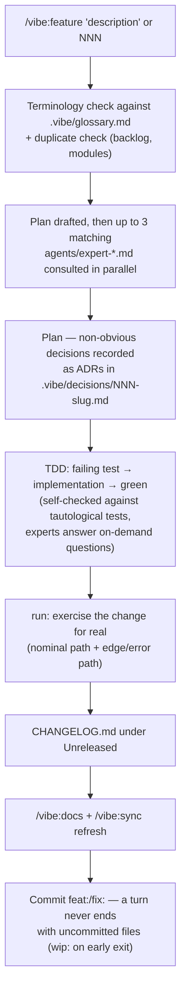
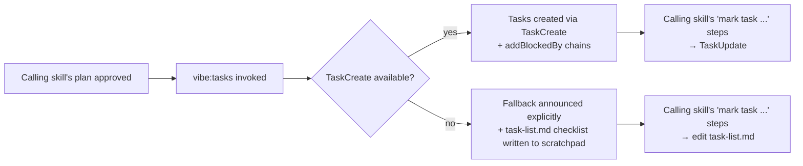
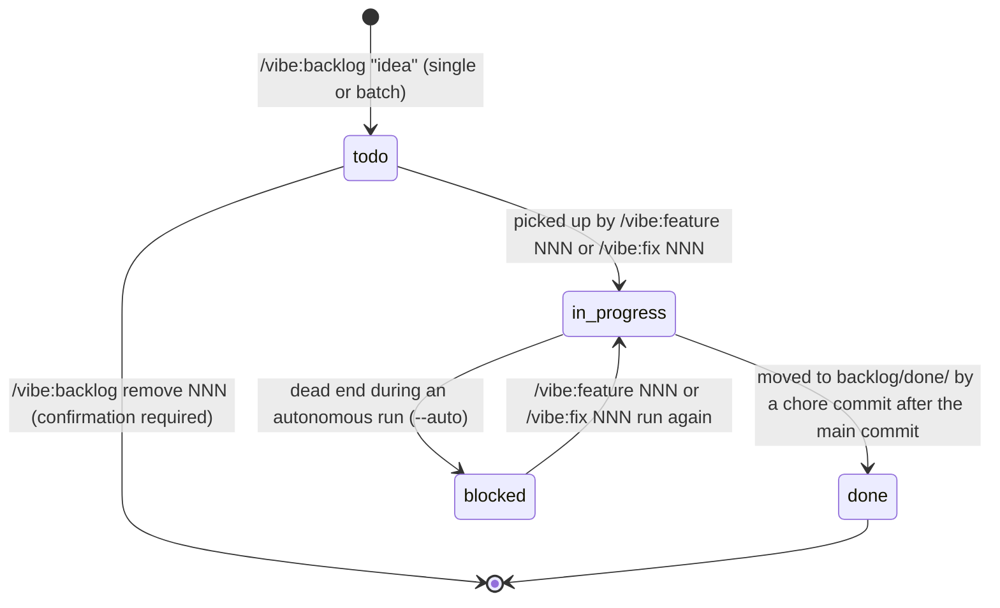
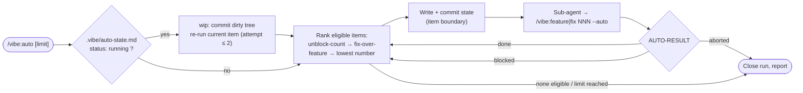
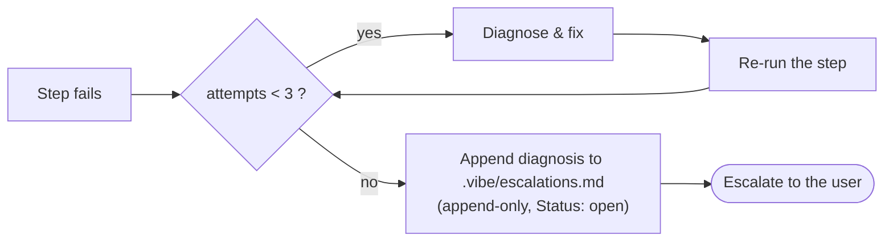
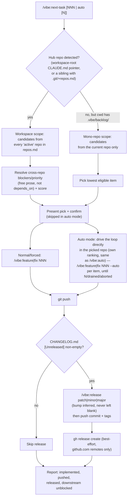

> Generated by /vibe:docs — manual edits will be overwritten; use README for hand-written content.

# Workflows

The lifecycles implemented by the `/vibe:*` commands. Static structure is covered in `docs/architecture.md`; this file describes what happens *over time*.

## Feature / fix lifecycle

`/vibe:feature` and `/vibe:fix` (defined in `skills/feature/SKILL.md` and `skills/fix/SKILL.md`) share the same spine — the fix variant reproduces the bug with a failing test first:

```mermaid
flowchart TD
    A["/vibe:feature 'description' or NNN"] --> B["Terminology check against .vibe/glossary.md<br/>+ duplicate check (backlog, modules)"]
    B --> C["Plan drafted, then up to 3 matching<br/>agents/expert-*.md consulted in parallel"]
    C --> C2["Plan — non-obvious decisions recorded<br/>as ADRs in .vibe/decisions/NNN-slug.md"]
    C2 --> D["TDD: failing test → implementation → green<br/>(self-checked against tautological tests,<br/>experts answer on-demand questions)"]
    D --> E["run: exercise the change for real<br/>(nominal path + edge/error path)"]
    E --> F["CHANGELOG.md under Unreleased"]
    F --> G["/vibe:docs + /vibe:sync refresh"]
    G --> H["Commit feat:/fix: — a turn never ends<br/>with uncommitted files (wip: on early exit)"]
```

`run` launches the app itself — finding or establishing how to start the project — so no separate fallback skill is needed if launch mechanics are the blocker; after 3 failed attempts the skill escalates directly.

Expert consultation is selection-based, not mandatory: an expert is invoked only if its domain (UI/UX, visual design, REST API, CLI, data, Linux/system, operations) clearly matches the task — often zero experts for a narrow bug fix. Domain mismatch is the *only* sanctioned reason to consult nobody: `feature`, `fix`, and `review` each state inline that their agent invocations are part of the command the user ran, so a session-level rule of the form "no sub-agents unless the user asks" cannot be read as a reason to skip them or to hand the decision back to the user. Each expert returns `REQUIREMENTS`/`RISKS`/`TEST SCENARIOS` folded into the plan at consultation time, and can be asked one further question per sub-task during implementation if a design question in its domain isn't answered by the codebase or the approved plan.

## Task tracking

`init`, `feature`, `fix`, `review`, `docs`, `release`, and `workspace-init` never call `TaskCreate` directly — each invokes the internal `skills/tasks/SKILL.md` once per run, right after its plan is approved, passing the task list (subjects + `blockedBy` chains) as `$ARGUMENTS`:

```mermaid
flowchart LR
    S["Calling skill's plan approved"] --> T["vibe:tasks invoked"]
    T --> A{"TaskCreate available?"}
    A -- yes --> C["Tasks created via TaskCreate<br/>+ addBlockedBy chains"]
    A -- no --> F["Fallback announced explicitly<br/>+ task-list.md checklist written to scratchpad"]
    C --> M["Calling skill's 'mark task ...' steps<br/>→ TaskUpdate"]
    F --> N["Calling skill's 'mark task ...' steps<br/>→ edit task-list.md"]
```

`tasks` owns the only fallback logic in the plugin for this failure mode, so every caller degrades the same way instead of each reinventing its own message. The scratchpad checklist preserves the declared order but does not enforce `blockedBy` — unlike a real `TaskCreate` chain, nothing stops a step from being checked out of order; the constraint holds only because the calling skill always executes its own steps sequentially.

`tasks` also owns the compact chat status-line convention for every transition it governs: `● <subject>` when a task starts, `✓ <subject>` when it completes (plus a concrete detail — a hash, a count — never restated prose). `/vibe:auto` and `/vibe:next-task` reuse the same three glyphs (adding `⚠` for blocked/aborted) one level down, per backlog item, since their item loops sit outside the task-list mechanism entirely.

## Backlog item lifecycle

Items live in `.vibe/backlog/NNN-slug.md` (shape in `.vibe/models.md`), created and committed on the spot by `/vibe:backlog`:

```mermaid
stateDiagram-v2
    [*] --> todo: /vibe:backlog "idea" (single or batch)
    todo --> in_progress: picked up by /vibe:feature NNN or /vibe:fix NNN
    in_progress --> done: moved to backlog/done/ by a chore commit after the main commit
    in_progress --> blocked: dead end during an autonomous run (--auto)
    blocked --> in_progress: /vibe:feature NNN or /vibe:fix NNN run again
    todo --> [*]: /vibe:backlog remove NNN (confirmation required)
    done --> [*]
```

## Autonomous run (`/vibe:auto`)

`/vibe:auto` drains the backlog with no human gate. Each item is handled by a dedicated sub-agent — strictly one at a time, since they share the Git working tree — which runs `/vibe:feature` or `/vibe:fix` with the `--auto` suffix; only a one-line `AUTO-RESULT:` verdict flows back, keeping the runner's context constant over a long run.

In `--auto` mode, each human gate has a fixed automatic resolution (table kept identical in both skills): ambiguities are decided and recorded as assumptions, the plan is self-approved, a duplicate or an unmet dependency sets the item to `blocked`, and a broken build aborts the whole run.

Picking the next item is a ranking, not a raw lowest-number scan: among eligible items (`todo`, `depends_on` satisfied, not yet processed this run), the item other same-repo `todo` items depend on the most wins first; a tie goes to a fix over a feature (same defect-vocabulary classification `/vibe:auto` records in the journal); the lowest number is only the final tie-break. The winning item's classification is already known from that ranking, so Step 2 (feature vs. fix) doesn't reclassify it.

```mermaid
flowchart LR
    start(["/vibe:auto [limit]"]) --> resume{".vibe/auto-state.md<br/>status: running ?"}
    resume -- yes --> recover["wip: commit dirty tree<br/>re-run current item (attempt ≤ 2)"] --> pick
    resume -- no --> pick["Rank eligible items:<br/>unblock-count → fix-over-feature → lowest number"]
    pick --> state["Write + commit state<br/>(item boundary)"] --> agent["Sub-agent → /vibe:feature|fix NNN --auto"]
    agent --> verdict{"AUTO-RESULT"}
    verdict -- done --> pick
    verdict -- blocked --> pick
    verdict -- aborted --> stop(["Close run, report"])
    pick -- "none eligible / limit reached" --> stop
```

Because the state file is committed at every item boundary, any interruption — crash, closed session, usage limit reached mid-item — is recovered by simply invoking `/vibe:auto` again. The skill never schedules itself: unattended restarts are delegated to the native `/loop` command (`/loop 45m /vibe:auto`).

Right after launching each item's sub-agent, the skill calls `ScheduleWakeup` (delay: 1200–1800s, rescheduled further out if it fires early) instead of waiting passively — the sub-agent's completion notification would otherwise sit unread in context until the user happens to send the next message. When the verdict is picked up on one of these scheduled wakeups (as opposed to a direct user turn), it is surfaced with `PushNotification` so a long unattended run doesn't silently update context with no one there to read it.

`/vibe:auto` also accepts `1` as the limit to space items apart on purpose — for human review, cost pacing, or CI capacity, not for usage-limit recovery. Each `/loop 30m /vibe:auto 1` firing processes exactly one item end to end and stops (Step 5, limit reached); the skill has no internal sleep of its own, so the spacing always comes from the interval between separate `/loop` invocations, the same mechanism that recovers from a usage limit mid-run.

## Self-correction and escalation

Every corrective loop in `feature`/`fix` (failing test, lint, `run`) is bounded to three attempts:

```mermaid
flowchart LR
    fail["Step fails"] --> try{"attempts < 3 ?"}
    try -- yes --> fix["Diagnose & fix"] --> rerun["Re-run the step"] --> try
    try -- no --> esc["Append diagnosis to .vibe/escalations.md<br/>(append-only, Status: open)"] --> user(["Escalate to the user"])
```

Escalation entries are read back at the start of every `feature`/`fix` run, so a dead end hit in one session informs the next; resolving work flips the entry to `resolved`. In `--auto` mode there is no one to escalate to: the entry is still written, the partial work is still committed as `wip:`, and the item is set to `blocked` so the autonomous run can move on.

## Feedback loops around review

- Each `/vibe:review` run rewrites `.vibe/last-review.md`; once 5+ `feat:`/`fix:` commits accumulate since that marker, feature/fix reports and the backlog list surface a "review is due" hint.
- At the start of every review, the agent activation table in `CLAUDE.md` is re-checked against the project's actual shape: audits whose surface appeared are switched on, vanished surfaces are switched off, deliberate opt-outs are never overridden — every change is reported.
- Pre-existing test failures discovered during a run are offered as backlog items instead of being silently ignored.

## Glossary lifecycle

`.vibe/glossary.md` is fully code-derived and self-cleaning (`skills/sync/SKILL.md`, Step 7). Every entry carries a `_Sources:_` line; at each sync — invoked automatically at the end of every feature/fix — terms are added, redefined when their backing usage changed, or removed (exclusion criteria or orphaned sources) with a reported reason, never a confirmation prompt.

## Release

`/vibe:release [major|minor|patch|X.Y.Z]` finalizes `CHANGELOG.md` (moving `[Unreleased]` under the new version), refreshes docs, bumps `version` in `.claude-plugin/plugin.json`, then commits and tags.

## Multi-repo workspace: pick, implement, publish

`/vibe:next-task` (defined in `skills/next-task/SKILL.md`) is the only command in the plugin that pushes and releases on its own — `feature`, `fix`, and `auto` deliberately stop at a local commit:

```mermaid
flowchart TD
    A["/vibe:next-task [NNN | auto [N]]"] --> B{"Hub repo detected?<br/>(workspace-root CLAUDE.md pointer,<br/>or a sibling with .git/+repos.md)"}
    B -- yes --> C["Workspace scope: candidates from<br/>every 'active' repo in repos.md"]
    B -- "no, but cwd has .vibe/backlog/" --> D["Mono-repo scope: candidates<br/>from the current repo only"]
    C --> E["Resolve cross-repo blockers/priority<br/>(free prose, not depends_on) + score"]
    D --> F["Pick lowest eligible item"]
    E --> G["Present pick + confirm<br/>(skipped in auto mode)"]
    F --> G
    G --> H1["Normal/forced: /vibe:feature|fix NNN"]
    G --> H2["Auto mode: drive the loop directly<br/>in the picked repo (own ranking, same<br/>as /vibe:auto) — /vibe:feature|fix NNN --auto<br/>per item, until N/drained/aborted"]
    H1 --> I["git push"]
    H2 --> I
    I --> J{"CHANGELOG.md<br/>[Unreleased] non-empty?"}
    J -- yes --> K["/vibe:release patch|minor|major<br/>(bump inferred, never left blank)<br/>then push commit + tags"]
    J -- no --> L["Skip release"]
    K --> M["gh release create (best-effort,<br/>github.com remotes only)"]
    L --> N["Report: implemented, pushed,<br/>released, downstream unblocked"]
    M --> N
```

**Auto mode drives the loop itself instead of delegating to `/vibe:auto`**: Step 5 already picked the exact repo, so handing off to `/vibe:auto`'s own selection would risk it picking a different item there. Each iteration re-collects the repo's eligible items, ranks them the same way `/vibe:auto` does (unblock-count → fix-over-feature → lowest number), and invokes `/vibe:feature NNN --auto` or `/vibe:fix NNN --auto` directly; the loop stops when `N` is reached, the backlog is drained, or an item comes back `aborted`.

If Step 8 (release) is blocked by a *pre-existing* test failure rather than a dirty tree or lint, `next-task` attempts one self-heal: it looks for an eligible backlog item that names the exact failing test file (the trace `/vibe:feature`/`/vibe:fix` leave when they defer an out-of-scope failure instead of silently fixing it). Exactly one match gets run via `/vibe:fix|feature NNN --auto` and the release is retried once; zero or multiple matches, or a retry that still fails, is reported as a follow-up blocker instead of retried further.

`/vibe:workspace-init` (`skills/workspace-init/SKILL.md`) sets up what `next-task` relies on for workspace scope: it writes/refreshes the hub repo's `repos.md` registry (never guessing a new sibling's status/role — asked when a `.vibe/backlog/` isn't there to infer `active` from) and the workspace-root `CLAUDE.md`, then commits inside the hub repo only — it never pushes, unlike `next-task`.

A cross-repo blocker distinguishes two different waits, both read from prose rather than any structured field: waiting on another repo's backlog item reaching `status: done`, versus waiting on that repo actually publishing a tagged release — the latter is only confirmed once `next-task`'s own push/release step lands a matching Git tag on the remote, checked again after every run (Step 9) to report any repo this just unblocked.
